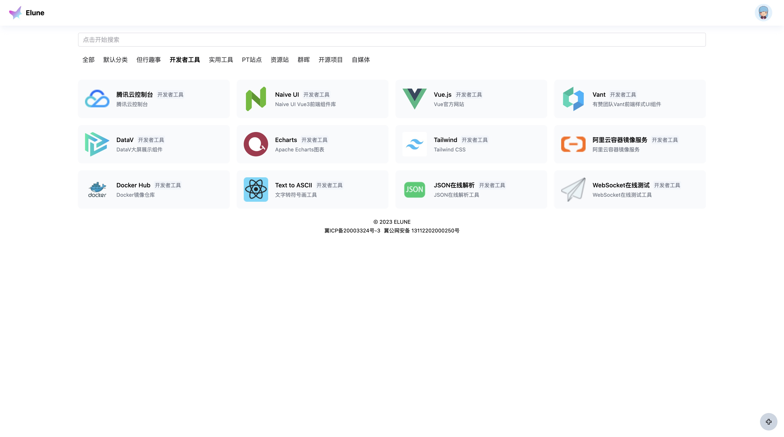
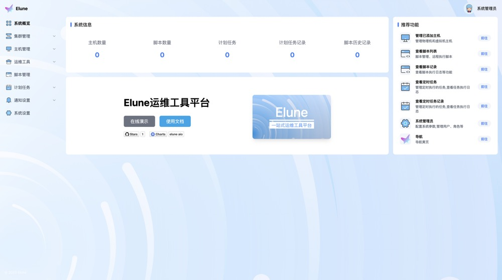
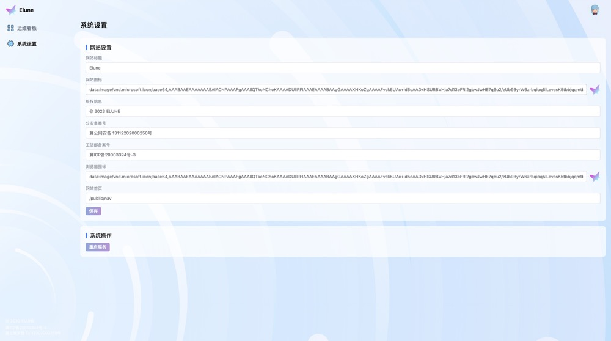

# Elune
elune一站式运维工具平台






## 特性列表
* 功能特性
  * 私有导航页（新增后端图片代理，防止前端https/http混用引起的跨域安全问题）
  * 运维管理看板
  * 系统管理看板
  * K8s集群管理（支持新增K8s集群）
  * 主机/虚拟机管理（支持新增主机/虚拟机/主机组/虚拟机组）
  * 脚本管理，支持远程执行、定时执行（支持多主机执行/按主机组执行）
  * 计划任务管理（支持启用/禁用定时任务，查看定时任务执行记录）
  * 通知管理（当前支持飞书webhook通知插件，支持添加消息通道、发送测试消息）
  * Elune系统自定义配置（自定义网站标题、网站图标、浏览器图标、版权信息、公安局备案、工信部备案、网站首页）
  * 系统重启

* 权限特性
  * 内置游客、普通用户、运维人员、系统管理员四种身份
  * 根据不同权限对各个功能进行权限管理（api权限控制+页面级权限控制）

## 安装
### 使用二进制应用程序运行
Elune已经预编译好了linux/amd64、linux/arm64、darwin/amd64、darwin/arm64版本的可执行文件，支持二进制文件一键启动【注意：建议测试环境使用，生产环境请使用Docker版本获取K8s版本】[下载地址](https://github.com/MR5356/elune-aio/releases)
```shell
curl -O https://github.com/MR5356/elune-aio/releases/download/v1.1.0-dev/elune-backend-linux-amd64.tar.gz
tar zxvf elune-backend-linux-amd64.tar.gz
mv elune-backend-linux-amd64 elune 
chmod +x elune
```
### 使用Docker安装
```shell
docker run -d -p 80:80 registry.cn-hangzhou.aliyuncs.com/toodo/elune-aio:v1.1.0-dev
```
### 使用K8s安装
```shell
helm upgrade --install --set image.tag="v1.1.0-dev" elune oci://registry-1.docker.io/toodo/elune-aio --version v1.1.0-dev
```

### 配置项
配置项适用于各种安装方式，支持以下环境变量进行配置：

* ELUNE_DEBUG: 开启`debug`模式
* ELUNE_PORT: 应用程序启动端口，默认为`5678`
* ELUNE_DATABASE_DRIVER: 数据库类型，默认为`sqlite`，可选为`sqlite`、`mysql`、`postgres`
* ELUNE_DATABASE_DSN: 数据库连接地址DSN格式，默认为`db.sqlite`，使用k8s部署默认为`/app/db/elune.db`
* ELUNE_CACHE_DRIVER: 缓存类型，默认为`memory`，支持`memory`、`redis`
* ELUNE_CACHE_DSN: 缓存连接地址，默认为`redis://localhost:6379?protocol=3`

## 使用
内置两个用户分别为：
* admin: admin
* devops: devops

## Star History

[](https://star-history.com/#mr5356/elune-aio&mr5356/elune&mr5356/elune-backend&Date)
